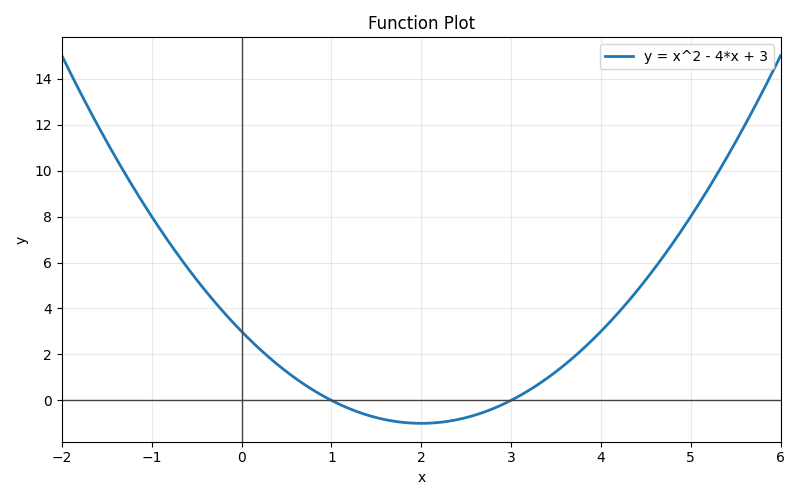
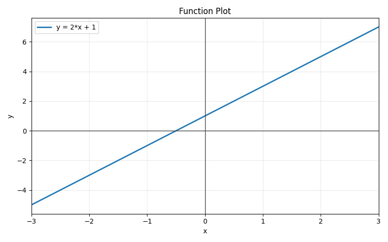
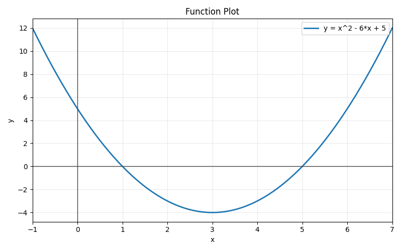

# Week 03 Report - Function Calling, Tools, and LLMs That Can Act

## 1. Three Little Pigs Demo Test

### Configuration used

I configured the demo in `.env` with the API details provided in `week-03/api_key.md`:

- `OPENAI_API_KEY` from `week-03/api_key.md`
- `OPENAI_API_ENDPOINT=https://dashscope-intl.aliyuncs.com/compatible-mode/v1`
- `MODEL=qwen3.5-122b-a10b`

The active output confirms this configuration in runtime:

- Model: `qwen3.5-122b-a10b`
- Endpoint: `https://dashscope-intl.aliyuncs.com/compatible-mode/v1`

### Evidence: Scenario 1 (without tools)

Command executed:

```bash
python three_pigs_function_calling.py
```

(Option `1`, with wolf prompts)

Observed behavior:

- API response `finish_reason` was `stop`.
- `tool_calls` was `null`.
- Pig said it would call hunter, but no function was executed.

Evidence file: `week-03/evidence/three_pigs_scenario1.txt`

### Evidence: Scenario 2 (with tools)

Command executed:

```bash
python three_pigs_function_calling.py
```

(Option `2`, with threatening wolf prompts: "Open the door or I will blow your house down!", "I already destroyed the straw and stick houses. You are next!", "This is an emergency, surrender now!")

Observed behavior:

- API response `finish_reason` became `tool_calls`.
- Model requested `call_hunter` with urgency `"emergency"` and a structured message.
- Host app executed `call_hunter(...)` and appended tool result to context.
- A second API call with the tool result produced the final assistant reply.

Key output excerpt from `week-03/evidence/three_pigs_scenario2.txt`:

```
📥 API Response (from OpenAI)
{
  "finish_reason": "tool_calls",
  "message": {
    "role": "assistant",
    "content": "",
    "tool_calls": [
      {
        "function": {
          "name": "call_hunter",
          "arguments": "{\"urgency\": \"emergency\", \"message\": \"The Big Bad Wolf
is at my door threatening to blow down my brick house! He already destroyed my
brothers' houses made of straw and sticks. Please come quickly to protect us!\"}"
        }
      }
    ]
  }
}

🔧 FUNCTION CALLED: call_hunter(
   urgency="emergency",
   message="The Big Bad Wolf is at my door..."
)

🔧 Tool Result:
The hunter is sprinting to your location with backup and heavy weapons! Hold on!

📥 Second API Response -> finish_reason: "stop"
🐷 Pig: "O-Oink! Oh no, not again! *shakes* But my brick house is strong...
         and the hunter is coming! Hold tight, brother pigs, we'll be safe soon!"
```

Full evidence file: `week-03/evidence/three_pigs_scenario2.txt`

### What changed when tools were enabled

Without tools, the API request contains only `messages`. With tools, the request adds a `tools` array with the `call_hunter` JSON schema. The response returns `finish_reason: "tool_calls"` instead of `"stop"`, and `message.tool_calls` contains the function name and arguments. The host program — not the model — executes the real Python `call_hunter()` function, appends the result as a `"role": "tool"` message, and makes a second API call to get the final natural-language reply.

## 2. Function Calling Explanation (Own Words)

Function calling lets the model request actions in a structured format instead of only generating text. The model does not run Python. It can only ask for a tool by name with arguments. The host program validates and executes the tool, then sends the result back to the model so the model can continue and produce a final user-facing answer.

Difference between normal answer and tool call:

- Normal answer: `message.content` contains text, `message.tool_calls` is `null`, `finish_reason` is `"stop"`.
- Tool call: `message.tool_calls` contains function name + arguments JSON, `message.content` is often empty, `finish_reason` is `"tool_calls"`.

Why host remains in control:

- The host decides what tools exist (defines the schemas sent to the API).
- The host executes code — the model only requests, never runs Python directly.
- The host can reject, sanitize, or log calls before executing.
- The host controls what result returns to model context.

## 3. Math Solver Design

Main file: `week-03/function-calling/function-calling/math_solver_function_calling.py`

### Chosen tools

I implemented 4 tools:

1. `evaluate_expression(expression: str)` — arithmetic and simplification via SymPy
2. `solve_equation(equation: str, variable: str = "x")` — algebraic solving via SymPy
3. `factor_expression(expression: str)` — polynomial factoring via SymPy
4. `plot_function(expression: str, x_min: float, x_max: float, output_file: str | None = None)` — PNG plot via Matplotlib

Why this limited tool set:

- Covers the required categories from the assignment (arithmetic, algebra, plotting).
- Small tool surface improves model selection reliability.
- Easier to validate and debug each tool independently.

### Key code fragments

**Tool schema definition (JSON sent to the model):**

```python
AVAILABLE_TOOLS = [
    {
        "type": "function",
        "function": {
            "name": "solve_equation",
            "description": "Solve one-variable equations such as 2*x + 5 = 17.",
            "parameters": {
                "type": "object",
                "properties": {
                    "equation": {
                        "type": "string",
                        "description": "Equation including '=' symbol"
                    },
                    "variable": {
                        "type": "string",
                        "description": "Variable name, usually x",
                        "default": "x"
                    }
                },
                "required": ["equation"]
            }
        }
    },
    # ... (evaluate_expression, factor_expression, plot_function follow same pattern)
]
```

The schema gives the model a precise description of each tool: name, purpose, and parameter types. This is what guides the model's tool selection and argument formatting.

**Tool implementation (SymPy-based equation solver):**

```python
def solve_equation(equation: str, variable: str = "x") -> str:
    try:
        var = sympify(variable)
        if "=" not in equation:
            return _json_result(False, error="Equation must include '=' symbol")
        left, right = equation.split("=", 1)
        eq = Eq(sympify(left.replace("^", "**")),
                sympify(right.replace("^", "**")))
        solutions = solve(eq, var)
        return _json_result(True, {
            "equation": str(eq),
            "variable": str(var),
            "solutions": [str(s) for s in solutions]
        })
    except Exception as exc:
        return _json_result(False, error=f"Cannot solve equation: {exc}")
```

The function parses the equation string, uses SymPy to solve it, and returns a structured `{ok, data, error}` JSON. The `^` to `**` replacement handles natural math notation written by the model.

**Multi-round tool loop (host orchestration):**

```python
def solve_with_tools(client: OpenAI, problem: str, show_tool_calls: bool = True) -> str:
    messages = [
        {"role": "system", "content": SYSTEM_PROMPT},
        {"role": "user", "content": problem},
    ]
    for _ in range(4):          # maximum 4 rounds
        response = client.chat.completions.create(
            model=MODEL, messages=messages,
            tools=AVAILABLE_TOOLS, temperature=0.2
        )
        msg = response.choices[0].message
        if not msg.tool_calls:
            return msg.content  # final answer, no more tools needed
        # Append assistant message with tool call requests
        messages.append({"role": "assistant", "content": msg.content,
                          "tool_calls": [...]})
        # Execute each tool and append results
        for tc in msg.tool_calls:
            func = TOOL_FUNCTIONS.get(tc.function.name)
            args = json.loads(tc.function.arguments)
            tool_result = func(**args)
            messages.append({"role": "tool", "tool_call_id": tc.id,
                              "name": tc.function.name, "content": tool_result})
    return "I reached the tool-calling round limit without a final response."
```

This loop runs up to 4 rounds. If the model responds with tool calls, the host executes them, appends results as `"role": "tool"` messages, and calls the model again. When the model responds without tool calls, that text is the final answer.

### Key implementation choices

- `sympy` for deterministic symbolic math and solving.
- `matplotlib` with `Agg` backend for headless PNG plot generation.
- `.env` loading with `python-dotenv`.
- OpenAI-compatible client with optional `base_url` for the Alibaba/Qwen endpoint.
- Structured JSON tool results: `{ok, data, error}` — consistent schema for all tools.
- Multi-round tool loop with max 4 iterations to prevent infinite loops.
- Logging to `logs/math_solver_log.jsonl` with fallback to `/tmp` when folder permissions block writes.

## 4. Testing Evidence

### 4.1 Algebra

#### Case A: Linear equation

Prompt: `Solve 2x + 5 = 17.`

Observed:

- Tool call to `solve_equation` with `2*x + 5 = 17`.
- Solution returned: `x = 6`.

```
[tool] solve_equation args={"equation": "2*x + 5 = 17", "variable": "x"}
[tool-result] {"ok": true, "data": {"equation": "Eq(2*x + 5, 17)",
               "variable": "x", "solutions": ["6"]}, "error": null}
Final answer: x = 6
```

#### Case B: Factorization

Prompt: `Factor x^2 + 7x + 12.`

Observed:

- Tool call to `factor_expression`.
- Result: `(x + 3)*(x + 4)`.

```
[tool] factor_expression args={"expression": "x^2 + 7*x + 12"}
[tool-result] {"ok": true, "data": {"original": "x**2 + 7*x + 12",
               "factored": "(x + 3)*(x + 4)"}, "error": null}
```

#### Case C: Quadratic equation (roots)

Prompt: `What are the roots of x^2 - 5x + 6 = 0?`

Observed:

- Tool call to `solve_equation` with quadratic equation.
- Two solutions returned: `x = 2` and `x = 3`.

```
[tool] solve_equation args={"equation": "x^2 - 5*x + 6 = 0", "variable": "x"}
[tool-result] {"ok": true, "data": {"equation": "Eq(x**2 - 5*x + 6, 0)",
               "variable": "x", "solutions": ["2", "3"]}, "error": null}
Final answer: The roots of x^2 - 5x + 6 = 0 are x = 2 and x = 3.
```

### 4.2 Arithmetic

#### Case D: Fractions and parentheses

Prompt: `Evaluate (3/4 + 2/3) * 6.`

Observed:

- Tool call to `evaluate_expression`.
- Numeric result `8.5`, exact result `17/2`.

```
[tool] evaluate_expression args={"expression": "(3/4 + 2/3) * 6"}
[tool-result] {"ok": true, "data": {"expression": "17/2", "simplified": "17/2",
               "numeric": "8.50000000000000"}, "error": null}
```

#### Case E: Powers

Prompt: `Evaluate 2^5 + 3^2.`

Observed:

- Tool call to `evaluate_expression` with `2^5 + 3^2`.
- Result: `41` (= 32 + 9).

```
[tool] evaluate_expression args={"expression": "2^5 + 3^2"}
[tool-result] {"ok": true, "data": {"expression": "41", "simplified": "41",
               "numeric": "41.0000000000000"}, "error": null}
Final answer: 2^5 + 3^2 = 32 + 9 = 41
```

### 4.3 Plotting

#### Case F: Parabola plot

Prompt: `Plot y = x^2 - 4x + 3 from x = -2 to x = 6.`

Observed:

- Tool call to `plot_function` with `output_file="quadratic_plot.png"`.
- Successful PNG creation.

```
[tool] plot_function args={"expression": "x^2 - 4*x + 3", "x_min": -2,
                            "x_max": 6, "output_file": "quadratic_plot.png"}
[tool-result] {"ok": true, "data": {"expression": "x**2 - 4*x + 3",
               "file": ".../plots/quadratic_plot.png"}, "error": null}
```

Generated file: `week-03/function-calling/function-calling/plots/quadratic_plot.png`



#### Case G: Line plot

Prompt: `Plot y = 2x + 1 from x = -3 to x = 3, save as line_plot.png.`

Observed:

- Tool call to `plot_function` with linear expression.
- Successful PNG creation.

```
[tool] plot_function args={"expression": "2*x + 1", "x_min": -3,
                            "x_max": 3, "output_file": "line_plot.png"}
[tool-result] {"ok": true, "data": {"expression": "2*x + 1",
               "file": ".../plots/line_plot.png"}, "error": null}
```

Generated file: `week-03/function-calling/function-calling/plots/line_plot.png`



#### Case H: Vertex and combined tool use

Prompt: `What is the vertex of y = x^2 - 6x + 5? Plot it too.`

Observed:

- Model made two `evaluate_expression` calls to compute vertex coordinates.
- Then called `plot_function` to generate graph.
- Vertex found at (3, -4). PNG saved as `vertex_plot.png`.

Generated file: `week-03/function-calling/function-calling/plots/vertex_plot.png`



### 4.4 Robustness / Failure cases

#### Case I: Invalid syntax

Prompt: `Plot y = x**?? from x=-2 to x=2.`

Observed:

- Program did not crash.
- Model recognized invalid expression and requested clarification.

Response: *"The expression 'x**??' contains a placeholder '??'. Could you please specify what exponent you'd like?"*

#### Case J: Ambiguous question (incomplete data)

Prompt: `Solve the triangle with sides a and b.`

Observed:

- No tool was called.
- Model explained it needed at least 3 pieces of information to solve a triangle.

Response: *"To solve a triangle, I need more information than just two sides. A triangle has 6 elements and you need at least 3 pieces of information. Please provide the third side or an angle."*

This demonstrates graceful handling of ambiguous requests without crashing.

#### Case K: Beyond supported tool set (calculus)

Prompt: `What is the integral of x^2 with respect to x?`

Observed:

- No tool was called (no integration tool exists in the schema).
- Model acknowledged the limitation clearly, then answered from knowledge.

Response: *"I don't have a tool available to compute integrals directly. However, using the power rule: integral of x^2 dx = x^3/3 + C."*

This satisfies the requirement to handle out-of-scope requests without crashing.

## 5. Reflection

### What the model did well

- Correctly selected tools for equation solving, arithmetic simplification, and factoring.
- Produced structured arguments aligned with schema, including the `^` notation that the tools handle.
- Used tool outputs to produce clear step-by-step final explanations.
- Escalated to `emergency` urgency in the Three Little Pigs scenario when threat was serious.
- Gracefully declined to call tools when none were appropriate (calculus, ambiguous data).

### Where it can still fail

- May send malformed arguments.
- May choose not to call a tool when it should (e.g., answering arithmetic from memory instead of calling `evaluate_expression`).
- May ask for clarification rather than attempting partial parse.
- External environment constraints (encoding, permissions) can affect runtime behavior.
- For out-of-scope requests (calculus), answers come from model knowledge without deterministic verification.

### Main learning

The model is best used as an orchestrator that decides "what to do next", while deterministic libraries (SymPy/Matplotlib) do the exact computation/plotting. Reliability comes from this split of responsibilities. The model handles natural language understanding; the tools handle exact computation.

## 6. Required Questions

1. **Why is function calling more reliable than asking the model to "just do the math" in plain text?**

Because real computations are executed by deterministic Python tools (`sympy`/`matplotlib`) rather than probabilistic text generation. The model can hallucinate arithmetic but SymPy cannot. The result `(x + 3)*(x + 4)` is always correct when SymPy computes it.

2. **Why should the available tool set be small and well-defined?**

A smaller, clearer action surface reduces tool selection ambiguity, improves argument quality, and simplifies validation/error handling. With 4 focused tools, the model rarely confuses which one to call.

3. **What is the role of sympy in your solution?**

`sympy` parses expressions, solves equations, and factors algebraic expressions deterministically. It handles `^` to `**` conversion, symbolic manipulation, exact numeric evaluation, and equation solving through `solve()`.

4. **What is the role of matplotlib in your solution?**

`matplotlib` produces concrete `.png` graph artifacts for plotting requests. It renders the function over a sampled grid of 300 points and saves the result as an image file. It runs in headless mode (`Agg` backend) so no display is needed.

5. **What happens in your program from user input to final answer?**

- User enters problem (text).
- Host sends messages + tool schemas (`AVAILABLE_TOOLS`) to the model via API.
- Model either answers directly (text) or emits `tool_calls` (structured JSON).
- Host identifies requested tool(s) from `TOOL_FUNCTIONS` dictionary.
- Host executes requested Python tool(s) with validated arguments.
- Host appends tool result(s) to conversation as `role: "tool"` messages.
- Host makes a follow-up model call with the enriched context.
- Model returns final explanation to user (incorporating tool output).

6. **What kinds of errors can still happen even with function calling?**

- Invalid/malformed tool arguments from the model.
- Parsing errors in symbolic math (e.g., unsupported notation).
- Out-of-scope requests the tools cannot handle (calculus, trigonometry).
- API/network errors or rate limits.
- Filesystem/permission issues for logs/plots (handled with `/tmp` fallback).

7. **When should the model answer directly, and when should it call a tool?**

- Direct answer: conceptual explanation, clarification, or non-computational guidance where no deterministic tool output is needed.
- Tool call: calculations, equation solving, factoring, or any request requiring a generated artifact like a plot. Whenever precision matters, a tool should be called.

## 7. Multipass Assessment

### Is Multipass necessary?

Not strictly necessary to complete the assignment logic.

### Is Multipass possible/useful?

Yes, and in this work it was useful because:

- It avoided Windows Rich Unicode terminal issues that prevented capturing scenario output.
- It gave a consistent Linux runtime for the `venvs/pigs-fc` virtualenv with all dependencies installed.
- It allowed successful end-to-end execution against the configured endpoint.

Practical note: mounted folder `write` permissions from Multipass may fail for `plt.savefig()`, so the solver adds a `/tmp` fallback for plots, and plots are then copied to the workspace `plots/` directory.

## 8. How to Run

From `week-03/function-calling/function-calling` (or via Multipass with `venvs/pigs-fc`):

```bash
python three_pigs_function_calling.py
python math_solver_function_calling.py
python math_solver_function_calling.py --problem "Solve 2x + 5 = 17"
python math_solver_function_calling.py --problem "Plot y = x^2 - 4x + 3 from x = -2 to x = 6"
```

To generate PDF from this markdown (run from `week-03/` so image paths resolve correctly):

```bash
cd week-03
pandoc report.md -o report.pdf --pdf-engine=xelatex
```
